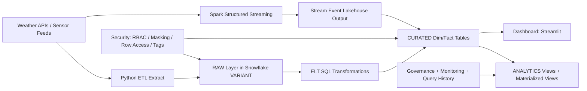

# Architecture Diagram

## Data Flow
1. Ingest API JSON into `RAW.weather_api_raw` as `VARIANT`.
2. Flatten nested data and merge into curated dimensions/facts.
3. Run batch Spark jobs for historical aggregations.
4. Run Spark streaming for near-real-time event windows.
5. Serve BI via analytics layer and dashboard.
